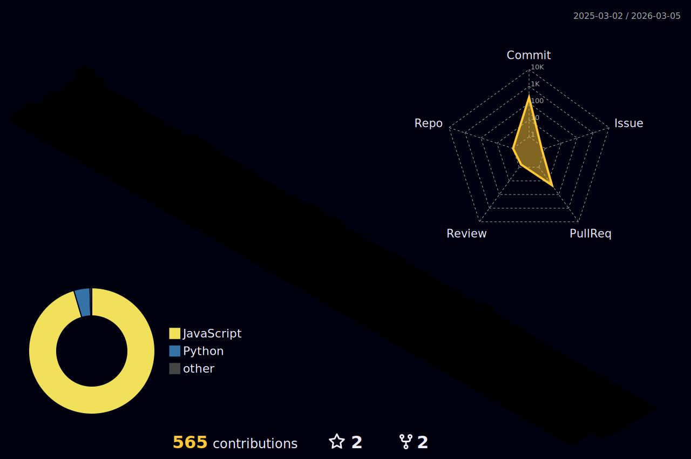

    

<!-- 自我介绍（动态）

-->

<!--lxfs-->

    
    
    

<!-- 分割线 -->
<table><tr><td valign="top" width="33%">

<!-- 贪吃蛇 -->
<picture>
  <source media="(prefers-color-scheme: dark)" srcset="https://raw.githubusercontent.com/CITATS928/CITATS928/output/github-contribution-grid-snake-dark.svg">
  <source media="(prefers-color-scheme: light)" srcset="https://raw.githubusercontent.com/CITATS928/CITATS928/output/github-contribution-grid-snake.svg">
  
</picture>

## 📈Statistics

<!-- 31天统计 (https://github.com/ashutosh00710/github-readme-activity-graph) -->

<!-- 3d contrib, night-rainbow view -->

<!-- 语言使用统计 -->

&emsp;&emsp;

&emsp;&emsp;

    
    

## My Skill Set  
<table><tr><td valign="top" width="33%">
    

  
  
