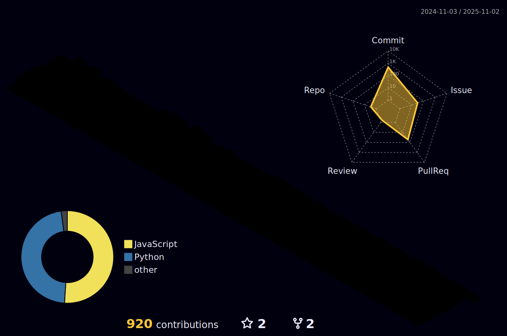

    

<!-- 自我介绍（动态）

-->

<!--lxfs-->

    
    
    

<!-- 分割线 -->
---

<!-- 贪吃蛇 -->
<picture>
  <source media="(prefers-color-scheme: dark)" srcset="https://raw.githubusercontent.com/CITATS928/CITATS928/output/github-contribution-grid-snake-dark.svg">
  <source media="(prefers-color-scheme: light)" srcset="https://raw.githubusercontent.com/CITATS928/CITATS928/output/github-contribution-grid-snake.svg">
  
</picture>

## Projects
#### [StarMeter](https://github.com/QueueTTP/CapStone)

  
  
  
  

#### [Prophecy(In Progress)](https://github.com/CITATS928/Prophecy)

  
  

## 📈Statistics

<!-- 31天统计 (https://github.com/ashutosh00710/github-readme-activity-graph) -->

<!-- 3d contrib, night-rainbow view -->

<!-- 语言使用统计 -->

&emsp;&emsp;

&emsp;&emsp;

    
    

## 🛠️My Skill Set  

#### Programming Languages

#### Data & Analytics

#### Databases

#### Cloud Services

#### Frameworks

#### Development Tools

#### Frontend Markup & Styling

#### Workflows

#### Others

## Visitor Count

    

## 📧Contact me:

     

